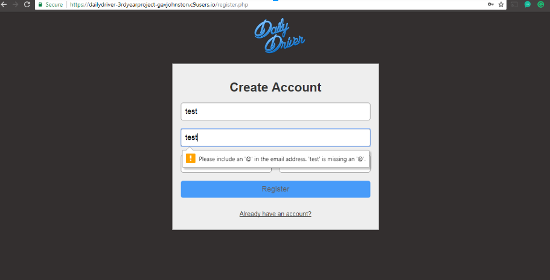
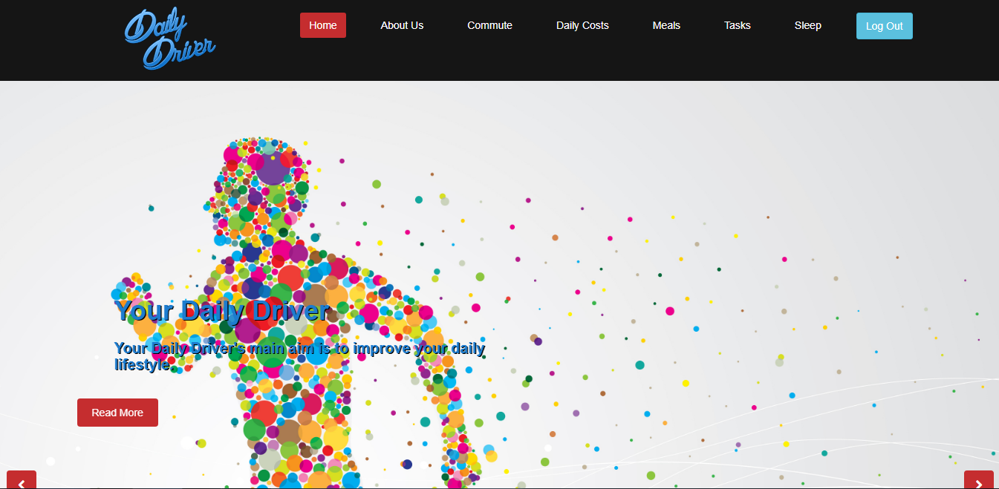
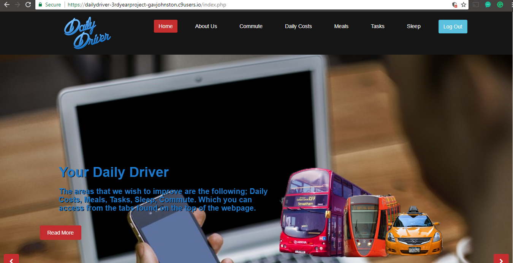
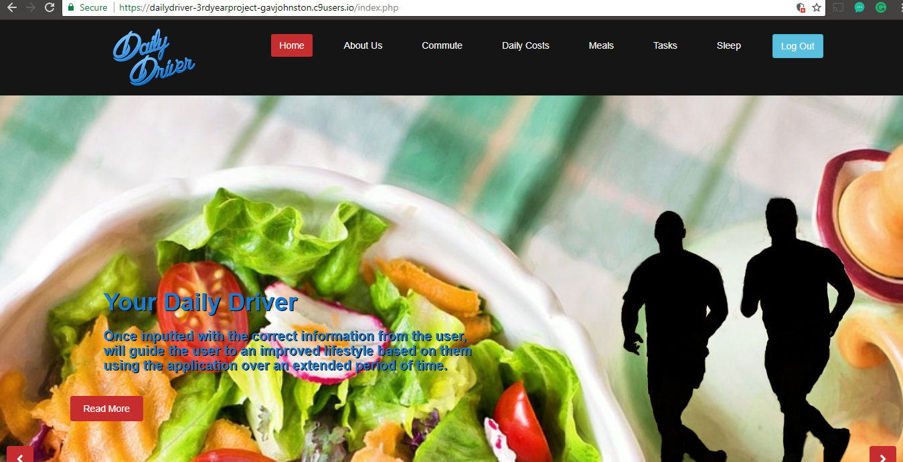
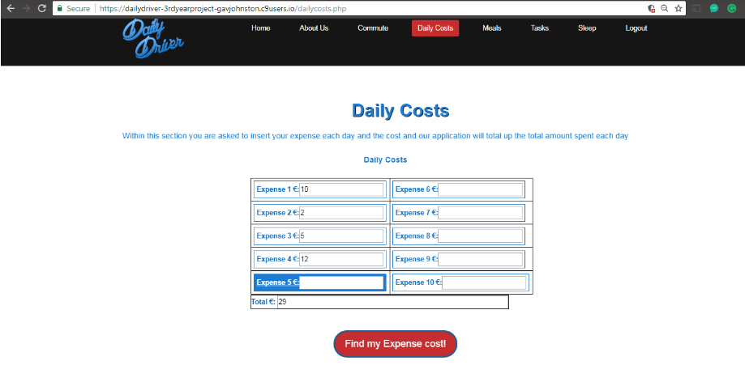
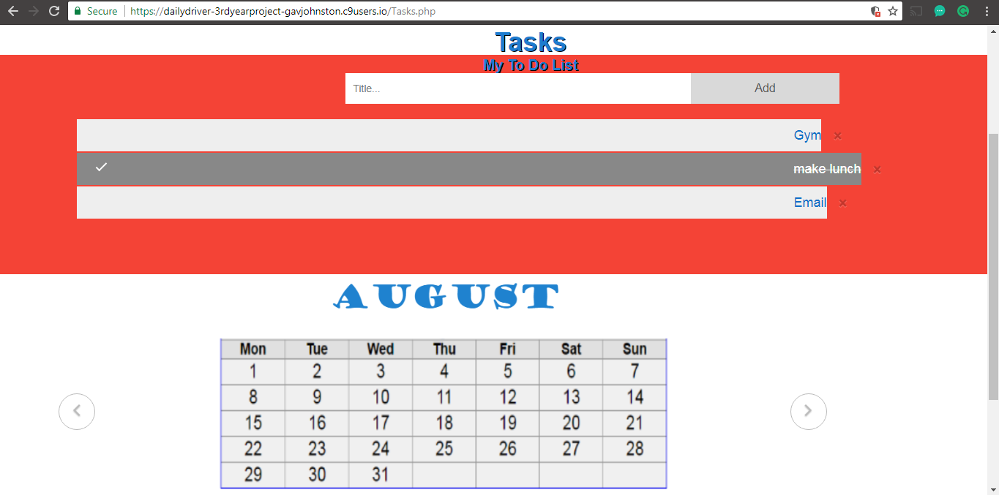
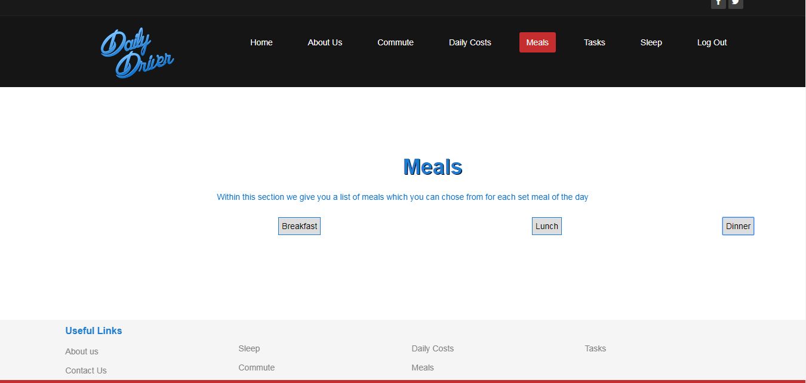
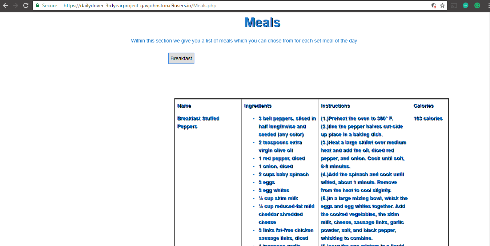
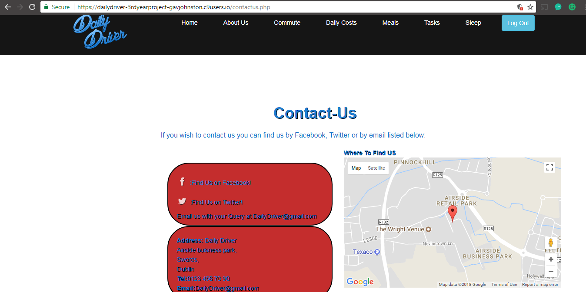

# 3rdYearProject-DailyDriver
A lifestyle improvement web application that I helped develop as part of my 3rd year Team project class. We developed this application because we felt there are applications that serve all these functions but very few that offer them all within the one application.  Once the user is registered and logs in they will have access to the following sections: Commute - Includes a google API that gives you directions and displays traffic conditions, also on this page there is a mock-up of our Public Transport API, which shows how long for your requested Bus, Luas and Train times.  Daily Costs - Used to add up your costs made throughout the day. To assist you in manage your money correctly. Meals - Displays suggested healthy meals for each main meal throughout the day. This also gives you the ingredients, instructions and a calorie count.  Tasks - Used to Input your daily tasks into a to-do list and delete them as completed, Also includes a slideshow of calendar months To improve organization. Sleep - This page offers the user the opportunity to calculate how many hours of sleep they need to have a productive night’s sleep.  Contact us - Contains links to our Facebook and Twitter page as well as our email if any questions should arise. There is also a google map section to find where our company is based.

Login/ register page with requirements and messages if requirements are not met

Homepage slideshow with additional dropdown text and images(taxi, tram and bus/ 2 shadows jogging)Which i created using stock photos and photoshop.

Simple calulator used to add up the users daily costs for the day

Google api key used to find the distance between point A to point B.

Javascript checklist where the user can Add and remove tasks as they wish also comes with a slideshow of calendar months.

Simple HTML table whichwhich expands  up suggested meals for the user to eat

google maps showing the location aswell as other relevant contact details aswell as a rotating font-awesome facebook and twitter logo

